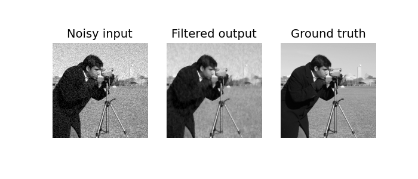

# Trainable Bilateral Filter Layer (PyTorch)

This repository contains our GPU-accelerated trainable bilateral filter layer (three spatial and one range filter dimension) that can be directly included in any Pytorch graph, just as any conventional layer (FCL, CNN, ...). By calculating the analytical derivative of the bilateral filter with respect to its parameters and its input, the (so far) hyperparameters can be automatically optimized via backpropagation for a calculated loss.

Our corresponding paper [Ultra low-parameter denoising: Trainable bilateral filter layers in computed tomography](https://arxiv.org/pdf/2201.10345.pdf) can be found at arXiv.

### Citation:
If you find our code useful, please cite our work
```
@article{wagner2022ultra,
  title={Ultra low-parameter denoising: Trainable bilateral filter layers in computed tomography},
  author={Wagner, Fabian and Thies, Mareike and Gu, Mingxuan and Huang, Yixing and Pechmann, Sabrina and Patwari, Mayank and Ploner, Stefan and Aust, Oliver and Uderhardt, Stefan and Schett, Georg and Christiansen, Silke and Maier, Andreas},
  journal={arXiv preprint arXiv:2201.10345},
  year={2022}
}
```

### Implementation:

The general structure of the implementation follows the PyTorch documentation for [creating custom C++ and CUDA extensions](https://pytorch.org/tutorials/advanced/cpp_extension.html). The forward pass implementation of the layer is based on code from the [Project MONAI](https://docs.monai.io/en/latest/networks.html) framework, originally published under the [Apache License, Version 2.0](https://www.apache.org/licenses/LICENSE-2.0). The correct implementation of the analytical forward and backward pass can be verified by running the gradcheck.py script, comparing numerical gradients with the derived analytical gradient using the PyTorch built-in [gradcheck function](https://pytorch.org/docs/stable/generated/torch.autograd.gradcheck.html).

### Setup:
The C++/CUDA implemented forward and backward functions are compiled via the setup.py script using setuptools:
1. Create and activate a python environment (python>=3.7).
2. Install [Torch](https://pytorch.org/get-started/locally/) (tested versions: 1.7.1, 1.9.0).
3. Compile/install the bilateral filter layer by calling
```python
python setup.py install
```


### Example scripts:
* Try out the forward pass by running the example_filter.py (requires [Matplotlib](https://matplotlib.org/stable/users/installing.html) and [scikit-image](https://scikit-image.org/docs/stable/install.html)).
* Run the gradcheck.py script to verify the correct gradient implementation.
* Run example_optimization.py to optimize the parameters of a bilateral filter layer to automatically denoise an image.

### Optimized bilateral filter prediction:

